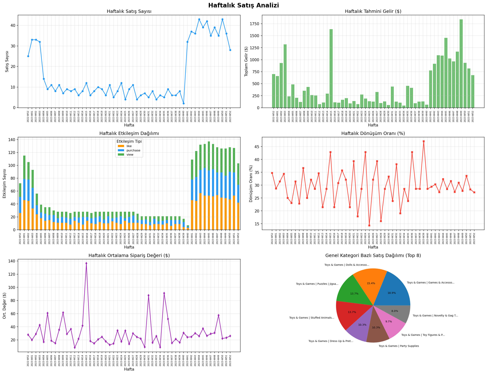

# 🛒 E-Commerce Veri Temizleme & Haftalık Satış Analizi

Bu proje, **ham e-ticaret verilerini** temizleyip analiz ederek **dönüşüm oranı, gelir ve kârlılık** gibi temel iş metriklerini üretir.  
Tüm analiz süreci tek komutla çalıştırılabilen, uçtan uca bir **data pipeline** olarak tasarlanmıştır.

> 🔁 Pipeline, `project/main.py` üzerinden merkezi olarak yönetilir.

---

## 📌 Proje Özeti

**Amaç:**
- Dağınık ve hatalı e-ticaret verilerini temizlemek
- Ürün ve etkileşim verilerini birleştirerek haftalık satış metrikleri üretmek
- Kârlılığı yüksek ürünleri tespit etmek

**Üretilen Metrikler:**
- Görüntülenme (view) & beğeni (like) sayıları
- Satın alma ve dönüşüm oranları
- Tahmini gelir
- Ortalama sipariş değeri (AOV)
- En kârlı ürünler

---

## 🚀 Proje Akışı

### 1️⃣ Data Cleaning  
📄 **Script:** `project/data_cleaning.py`

- Ham ürün verisini okur  
  `project/data/product_details.csv`
- Sütun adlarını standartlaştırır
- Veri tiplerini dönüştürür
- Metin alanlarını temizler  
  (özellikle `about_product` içindeki tırnak/virgül problemleri)
- Temizlenmiş veri üretir


---

### 2️⃣ Weekly Sales Analysis  
📄 **Script:** `project/weekly_sales_analysis.py`

- Ürün verisi ile etkileşim verilerini birleştirir  
  (view / like / purchase)
- Haftalık bazda özet metrikleri hesaplar
- Konsola özet analiz basar
- Analiz sonuçlarını CSV olarak kaydeder


---

## 🗂️ Klasör Yapısı

```text
project/
│
├── data/
│   ├── product_details.csv                # Ham ürün verisi
│   ├── E-commerece sales data 2024.csv     # Etkileşim verileri
│   ├── customer_details.csv               # Müşteri detayları
│   ├── cleaned_product_details.csv        # Temizlenmiş ürün verisi
│   └── processed/                          # Analiz çıktıları
│
├── data_cleaning.py                        # Veri temizleme
├── weekly_sales_analysis.py                # Haftalık satış analizi
└── main.py                                 # Pipeline çalıştırıcı

⚙️ Kurulum
Gereksinimler

Python 3.x

Gerekli paketler:

    pandas

    numpy
pip install pandas numpy

▶️ Çalıştırma
Projenin kök dizininde aşağıdaki komutu çalıştırın:
python project/main.py

Bu komut sırasıyla:
    data_cleaning.py
    weekly_sales_analysis.py
scriptlerini çalıştırır.
⛔ Eğer herhangi bir adım hata verirse pipeline durur.

📦 Üretilen Çıktılar
Temizlenmiş Veri
    project/data/cleaned_product_details.csv

Analiz Sonuçları (örnek)
    project/data/processed/top50_profitable_products.csv

🧠 Notlar & Olası Sorunlar
📁 Çalışma Dizini

main.py, çalışma dizinini otomatik olarak project/ olarak ayarlar

Tüm dosya yolları buna göre göreli tanımlanmıştır

📄 CSV Format Problemleri

Ürün açıklamalarında yoğun metin, tırnak ve virgül bulunduğundan
veri temizleme adımı kritiktir

Hata durumunda ilk kontrol edilmesi gereken dosya:
project/data_cleaning.py

## 📈 Weekly Sales Dashboard



## 🔍 Key Insights

- Ortalama haftalık dönüşüm oranı: 3.8%
- En karlı kategori: Electronics
- Ortalama sipariş değeri: $74
- Satışların %40'ı top 20 üründen geliyor
